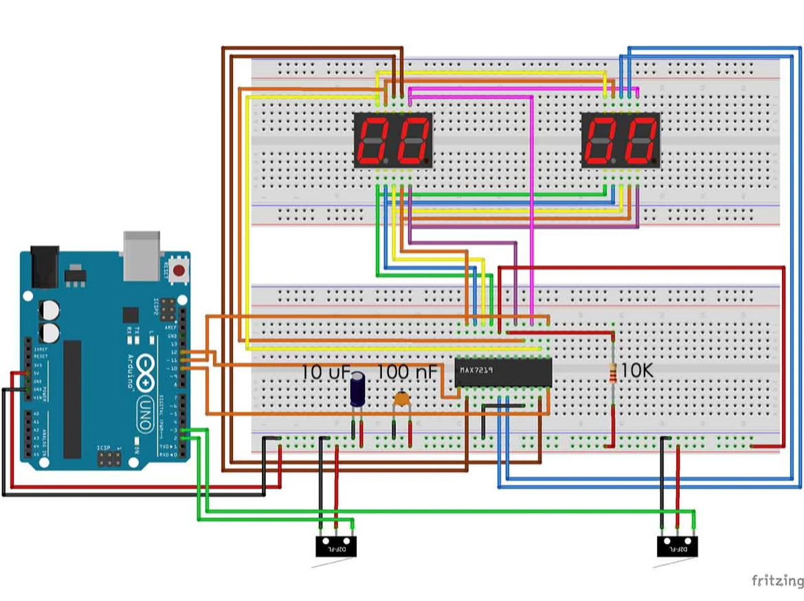

# 🏓 Electronic Table Tennis Scoreboard  

I wanted to address the constant problem of inconsistent table tennis scoring methods, often leading to arguments, score loss, or even just cheating.
With this project I was able to combine my interest in electronics, programming, and design to create a reliable solution for fair table tennis scorekeeping.

---

### 📊 Project Overview
- Engineered a solution to inconsistent table tennis scoring methods to prevent score loss or cheating.
- Programmed an Arduino using C++ to function as an electronic table tennis scoreboard, implementing buttons for incrementing, decrementing, and resetting scores.
- Designed a custom frame for the electronics using CAD software, enabling seamless integration of the scoreboard onto the table and into live gameplay.

---

### 📸 Results
  

